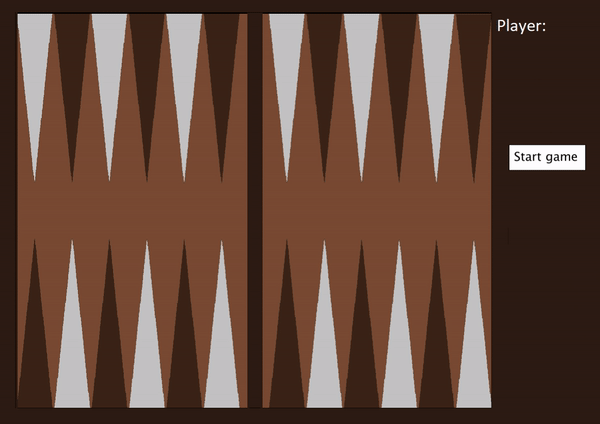

# Backgammon / Tavla - (PiS, SoSe2021)


Autor: Samir Faycal Tahar M'Sallem, 5276295


## Kurzbeschreibung 

Umgesetzt wurde eine Variante des Klassikers Backgammon. 

Bei diesem Spiel treten zwei Personen gegeneinander an. Ziel ist es, die eigenen Steine vom Spielbrett zu bekommen und so die Partie für sich zu entscheiden. Dabei werden 2 Würfel zur Hilfe gezogen, deren Augenzahlen die möglichen Spielzüge vorgeben. Beide Spieler spielen in die jeweils entgegengesetzte Spielrichtung und stets nacheinander im Wechsel. Die beiden Spieler können sich gegenseitig hindern. Hierbei gibt es die Möglichkeit offene Steine – also Felder, auf denen nur genau ein Stein steht - wieder zum Anfang zurück zu zwingen, indem man auf diesem Feld landet und den Stein somit rauswirft. Zum anderen können sog. Blockaden geschaffen werden, indem auf Feldern mehr als 2 Steine platziert werden. Diese Blockaden können zwar übergangen werden, aber man kann nicht auf Ihnen direkt landen. Folglich ist immer nur eine Steinfarbe pro Feld möglich.  (139 Wörter)

## Screenshot



## Bedienungshinweise

Die Ausführung des Spiels und der Tests erfolgt mit den bekannten Gradle Befehlen.

Im Hauptverzeichnis `gradle run` startet das Spiel

`gradle test` führt die vorgefertigten Tests aus.

- Nach Starten und klicken des Startknopfs, bildet sich der Standard-Aufbau der Steine 
- Der beginnende Spieler würfelt die 2 Würfel durch klicken des Würfel-Knopfes
- `Für den Fall, dass der Spieler einen Pasch würfelt, sieht das Spiel vor, dass der Spieler die Augenzahlen, statt 2 mal 4 mal erhält`
- Durch Klicken auf einen bewegbaren Stein und einer anschließenden Zielposition wird ein Zug gemacht
- `Für den Fall, dass ein Stein nicht bewegt werden kann, wird dieser nicht markiert. Auch wird für Steine die an mehrere Positionen verschoben werden können, alle möglichen Positionen markiert`
- Der Spieler ist so lange an der Reihe bis er keine Augenzahlen mehr übrig hat, oder keine Züge mehr vollziehen kann
- Im Falle, dass ein Spieler auf einem Feld landet, auf dem nur ein Stein des Gegenspielers ist, wird dieser Stein aus dem Spiel geworfen
- Der Spieler muss dann seinen Stein in ein mögliches Feld wiedereinsetzen.
- `Der Spieler kann keinen Zug machen, bevor nicht alle seine Steine wieder im Spiel sind`
- Sobald der Spieler alle seine Steine in seinen Heimbereich gebracht hat, kann er beginnen seine Steine aus dem Spiel zu räumen
- `Dies geschieht mit einem Doppelklick`
- So kann er z.B mit der Augenzahl 5 einen Stein aus dem Feld 5 entnehmen
- Sofern alle Steine auf den Feldern nicht mit der Augenzahl übereinstimmen und der Spieler keinen Stein hat, welcher >= der Augenzahl ist, kann der nächstmögliche Stein entnommen werden.
- `Ein Beispiel: Augenzahl 3 und 5, Steine auf Feldern 1,2,3,4: Der Spieler kann einen Stein von Feld 3 entnehmen und darf dann mit der Augenzahl 5 einen Stein von 4 entnehmen.`
- Das Spiel ist entschieden, sobald ein Spieler alle Steine vom Brett geräumt hat


## Dateiübersicht und Lines of Code
		     
```
\README.md
\build.gradle
\core.jar
\sample.png
\bin\main\bg.png
\bin\main\backgammon\AL.class
\bin\main\backgammon\App.class
\bin\main\backgammon\GameEngine.class
\bin\main\backgammon\Stone.class
\bin\test\backgammon\AppTest.class
\src\main\java\backgammon\AL.java
\src\main\java\backgammon\App.java
\src\main\java\backgammon\GameEngine.java
\src\main\java\backgammon\Stone.java
\src\main\resources\bg.png
\src\test\java\backgammon\AppTest.java
```		

```		
-------------------------------------------------------------------------------
Language                     files          blank        comment           code
-------------------------------------------------------------------------------
Java                             4            152            165            477
-------------------------------------------------------------------------------
SUM:                             4            152            165            477
-------------------------------------------------------------------------------

LOC: 477
AL-LOC: 255 (Interface miteingerechnet)
-> ALP: 0,53
Tests: 26
```


## Quellenangaben
Die unten genannten Quellen und Literaturen dienten während der gesamten Projektarbeit zum Zwecke der Aneignung von Wissen, zur Anwendung in der Projektarbeit.

Der größte Teil der hier aufgelisteten Medien diente damit lediglich zur Erweiterung des Programmierhorizonts, dabei wurde keinerlei Code direkt übernommen!
- [Processing Language Reference](https://processing.org/reference/) (insbesondere image(), ellipse() und color()) zuletzt abgerufen am 27.06.2021
- [Infozettel Stream Grundlagen, Matthias Eurich](https://moodle.thm.de/pluginfile.php/325977/mod_resource/content/4/02_streams.html) zuletzt abgerufen am 27.06.2021
- [Infozettel Stream Operationen, Matthias Eurich](https://moodle.thm.de/pluginfile.php/325978/mod_resource/content/1/03_streams.html) zuletzt abgerufen am 27.06.2021
- [Wie man zwei Objekte vergleicht, Dominikus Herzberg](https://drive.google.com/file/d/1kYmFtx-mALCyR1FSVfQ6RgzbIrv4Sa-M/view) zuletzt abgerufen am 27.06.2021
- [Junit 4 Assertations](https://github.com/junit-team/junit4/wiki/Assertions) zuletzt abgerufen am 27.06.2021
- [Das große PiS-FAQ, Daniel Sprengler](https://github.com/DSpengler99/pis_faq_ss21) zuletzt abgerufen am 27.06.2021
- [Readme Template zur Abgabe](https://moodle.thm.de/pluginfile.php/796890/mod_resource/content/0/README.Template.md) zuletzt abgerufen am 27.06.2021


